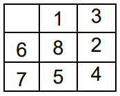
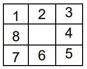

# bfs-dfs

Um simples programa para solucionar o problema das 8 peças através da busca em largura e busca em profundidade. O problema consiste em organizar 8 peças numeradas de 1 a 8 em um tabuleiro em ordem crescente. O tabuleiro possui 9 espaços, portanto, somente uma peça pode ser movida por vez para o espaço vazio. O algoritmo para quando o tabuleiro atinge o estado de aceitação.

     *Estado Inicial*        *Estado Final*
